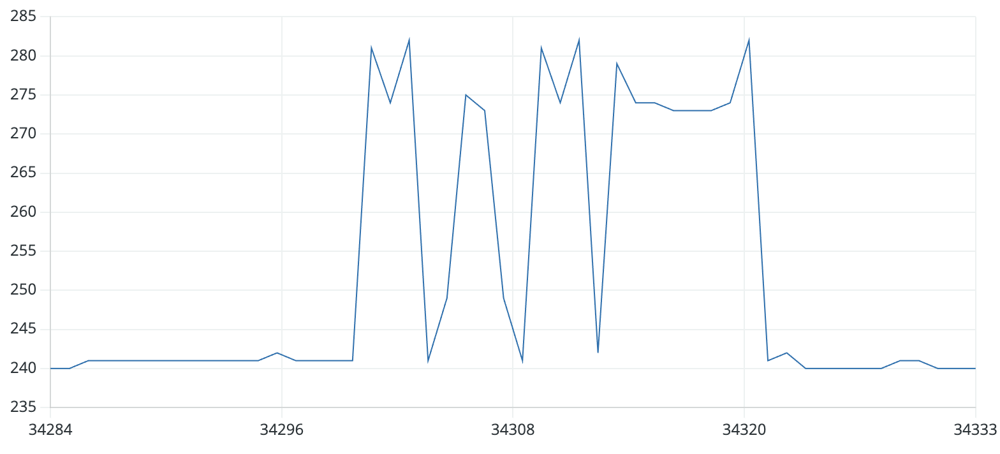
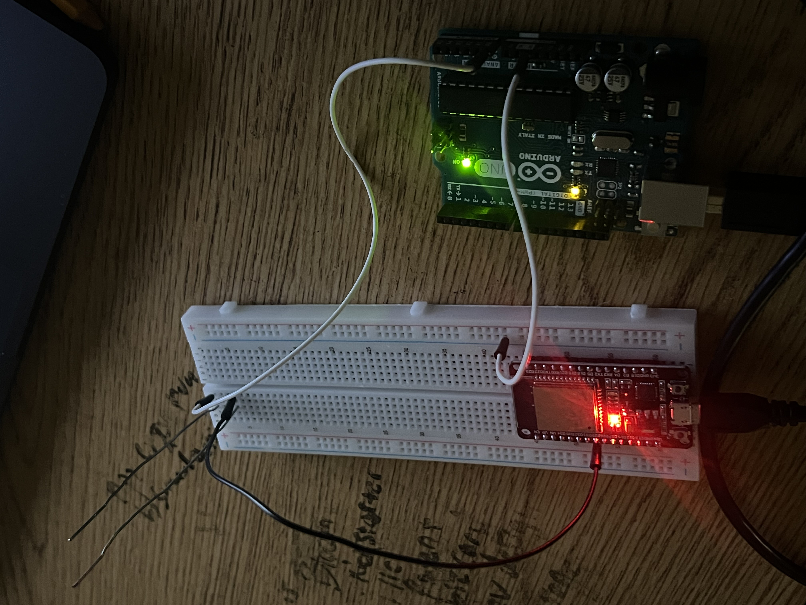

# Wireless Paperclip Telegraph: Arduino & ESP32 SDR Project

**Course Final Showcase Project**

This project demonstrates the principles of **Software Defined Radio (SDR)** and **Near-Field Communication** using nothing more than two microcontrollers and everyday paper clips. By manipulating the internal hardware timers of an ESP32, we generate an 800 kHz Amplitude Modulated (AM) radio signal to transmit Morse code wirelessly to an Arduino Uno receiver.

---

## 🎯 Purpose
1.  **Transmission:** Successfully transmit the letter 'V' in Morse code wirelessly.
2.  **Decoding:** Transmit and decipher the full phrase "HELLO WORLD" from Morse code using custom receiver logic.

---

## 🛠️ Supplies Needed
* **1 x** ESP32 Dev Board (Transmitter)
* **1 x** Arduino Uno R3 (Receiver)
* **1 x** 100mm Paper Clip (Large - used for TX Antenna)
    * *Note: Ensure this is the large size clip for better transmission.*
* **1 x** 8.5mm Paper Clip (Small - used for RX Antenna)
* **1 x** Long Breadboard
* **2 x** Male-to-Male Jumper Wires

---

## 🔌 Circuit Connection

1.  **Antenna Placement:**
    * Place the two paper clips on the breadboard so they are standing upright or lying flat.
    * Ensure they are **parallel** to each other (`||`).
    * Start with a distance of **20mm** (approx. 0.8 inches) between them.

2.  **Transmitter (ESP32):**
    * Place the ESP32 on one side of the breadboard.
    * Connect a wire from **GPIO 25 (D25)** to the **100mm (Large)** paper clip.

3.  **Receiver (Arduino Uno):**
    * Connect a wire from **Analog Pin A0** to the **8.5mm (Small)** paper clip.

4.  **Upload:**
    * Push the respective code to each board (Transmitter code to ESP32, Receiver code to Uno).

---

## ⚙️ How It Works (The 'V' Test)

This project uses a "hacky" method to turn a standard digital pin into a radio transmitter.

### The Physics
* **ESP32 LEDC Peripheral:** We use the ESP32's LED Control hardware to oscillate Pin 25 ON and OFF extremely fast.
* **The Math:** The frequency is determined by the internal clock (80 MHz) and the resolution (bits).
    $$\text{Max Frequency} = \frac{80,000,000 \text{ Hz}}{\text{Prescaler} \times 2^{\text{Resolution Bits}}}$$
* **Why 4-Bits?**
    * At **10-bit** resolution, the max frequency is only ~78.1 kHz (Too slow for radio).
    * At **4-bit** resolution, the max frequency jumps to **5 MHz**.
    * This allows us to easily hit the target **800 kHz carrier frequency**.
* **The Antenna:**
    * **TX (Long Clip):** Maximizes surface area for **Capacitive Coupling**, ensuring a stronger electric field is generated to push the signal.
    * **RX (Short Clip):** Placed within the transmitter's intense "Near-Field" region to pick up enough energy to register a voltage change (similar to a capacitor plate).

---

## 🔧 Debugging Guide

**1. Too Much Noise?**
* **Touch to Ground:** Touch the metal USB housing of the receiving Arduino Uno. Your body acts as a massive ground plane, shunting the 60Hz mains hum (ambient noise) away from the sensitive input pin. This low-impedance path clears up the signal significantly.
* **Alignment:** If noise persists, ensure the clips are **exactly parallel**. This helps with impedance matching and ensures the correct trajectory of the signal.

**2. Long Distance Failing?**
* **Inverse Cube Law:** Near-field signals lose power proportional to $1/r^3$ (where $r$ is distance). If the signal is weak, move the clips closer (20mm).

**3. Test Output Log**
* *Initial Failure:* `HEQL ?ORL ?EPL ?OG` (Timing was too fast; dots were merging into dashes).
* *Final Success:* `--- LISTENING FOR: HELLO WORLD --- E??ELLOWORLD HELLOWORLD HE`

---

## 📚 Key Concepts (FAQ)

**Q: What is Duty Cycle?**
A: The percentage of time a signal is "ON" versus "OFF" in one period. For the carrier wave, we use 50% (ON half the time, OFF half the time).

**Q: What is a Prescaler?**
A: A hardware divider that slows down the main system clock. We set it to 1 (no division) to run the timer as fast as possible.

**Q: What are Resolution Bits?**
A: The "step count" for the timer. A higher resolution (e.g., 10-bit) allows fine control of the duty cycle but forces the frequency to be lower. We lowered it to 4-bit (coarse control) to unlock high speeds (5 MHz max).

**Q: What is Carrier Frequency?**
A: The high-speed wave (800 kHz) that carries the data. The Morse code turns this wave ON and OFF (Amplitude Modulation).